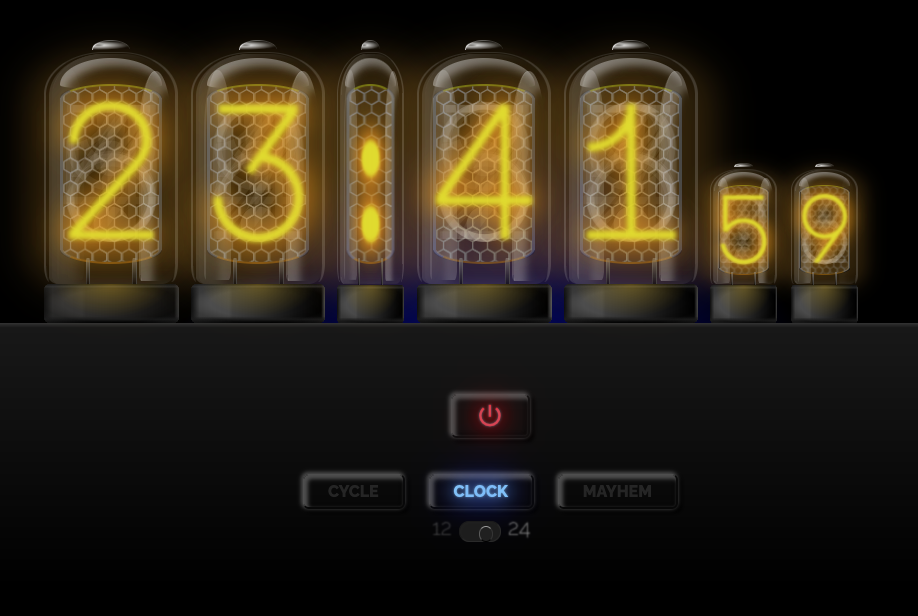

# NixieTubes
Pure CSS Nixie tubes

  

<h1 align="center"> Hi, I’m @darinmurray </h1>

A deceptively simple clock emulating vintaeg Nixie tubes. 

Everything is completely created with HTML/CSS/Jquery-Javascript.

No images are used in this clock. 

Outcomes:

Use pure CSS/jQuery-Javascript to illustrate objects that would normaly be injected as an image.

Make a working clock with Military/24hr time opton to show use of the tubes.

